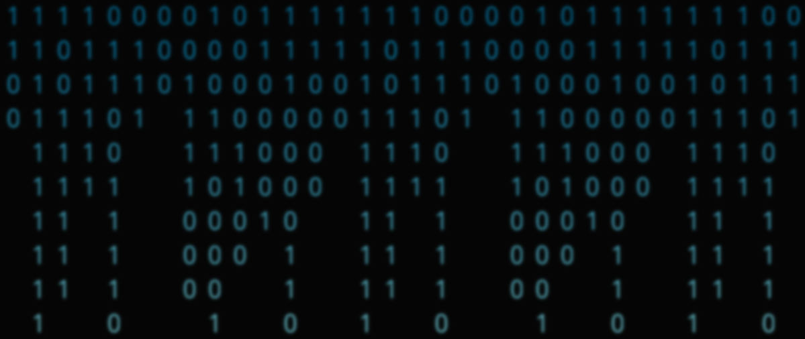

# Which Programming Language Should I Learn First?

 | 🔗 [link to the live site](https://first-programming-language.netlify.app/)

## Table of Contents
- [Which Programming Language Should I Learn First?](#which-programming-language-should-i-learn-first)
  - [Table of Contents](#table-of-contents)
  - [Instruction](#instruction)
  - [About](#about)
    - [Language & Framework Used](#language--framework-used)
    - [Why Did I Make This](#why-did-i-make-this)
    - [About the Background](#about-the-background)
    - [Challenges](#challenges)
  - [🗺 Roadmap](#-roadmap)
  - [👷‍♂️ Contributors](#️-contributors)
  - [📃 Change Logs](#-change-logs)
    - [2/16/22](#21622)
    - [2/7/22](#2722)
    - [1/30/22](#13022)
  - [For bugs & suggestions](#for-bugs--suggestions)

## Instruction
At the website, click the button as prompted.  
To navigate using the keyboard, use the <kbd>tab</kbd> key to highlight the choices and <kbd>shift</kbd> + <kbd>tab</kbd> to go back to the previous option.

## About
An interactive quiz about picking the first programming language built in React 

### Language & Framework Used
+ React
  + functional components
  + react hooks: state, effect, ref
+ CSS for styling

### Why Did I Make This
I've seen many beginners asking, "Which language should I learn first?" when it comes to programming. Some have an idea of what they want to do with programming, and some don't.  
This inspired me to build this interactive quiz using React.js, based on this flowchart: http://carlcheo.com/startcoding.  
The flowchart is somewhat dated, but it still provides a good pointer for newcomers who don't know which language to learn first.  

### About the Background
The background binary code comes from the Python print statement:  

    print("hello world!")

Some pure CSS visuals I've seen on various websites inspired me to make the background component using only CSS. I used the React ref and effect hooks to get the current window size and render the component as a repeating pattern.

### Challenges
The background did not work as intended at the initial release: 
- It did not span across the browser window
- It did not show on iOS devices and Safari browser
  
While building the quiz, I had two options: 1) use callback functions within functions and then call the function depending on the choices, or 2) use an object to structure the questions and choices and then parse them through the function, for example:

    choices: {
        choice1: index of this choices lead to
    }

The first method was easier to code, but I chose the second method for these reasons:
1. Separation of concerns. By seperating the texts and functions, I can debug the function and adjusting the text seperately.
2. Reusability. If I want to build a quiz in React again, I can take the functions and reuse them following the object structure and adjust it as needed.

Lastly, an edge case caused one of the results to display properly, and it was unknown until a user reported the bug. Automated testing may prevent this from happening, and in the future, I will look into automated testing for sites created with React.

## 🗺 Roadmap
- [x] change styles to make it more visually appealing
- [ ] Add description to programming languages at result page

## 👷‍♂️ Contributors
Thanks to the following users for suggestions/helping with the issues:
+ [@evergreenlilac](https://github.com/evergreenlilac)
  + [suggested new features](https://github.com/yingmo55/which-language-first/issues?q=is%3Aissue+author%3Aevergreenlilac) for this project
+ Jordan Cruz-Correa ([@jccdev45](https://github.com/jccdev45))
  + added the [random feature](https://github.com/yingmo55/which-language-first/issues/6)
+ Sarthak Verma ([@SRKVRM](https://github.com/SRKVRM))
  +  added [the reset button](https://github.com/yingmo55/which-language-first/issues/5)

## 📃 Change Logs
### 2/16/22
**Style Changes**  
+ Fix issue where background does not show on iOS devices /safari
+ Adjust Contrast for message box and text
+ Update Background binary
+ update README.md with contributors
+ Fix typos

### 2/7/22
+ Quiz is now functional
+ Adjsut styling
 
### 1/30/22
+ Began project

## For bugs & suggestions
Please submit an issue if you encounter any bugs or have any suggestions for the content or code base.